<picture>
  <source media="(prefers-color-scheme: dark)" srcset="assets/header-dark.svg">
  
</picture>

  <a href="https://linkedin.com/in/percy-amoani" title="LinkedIn"><picture>
    <source media="(prefers-color-scheme: dark)" srcset="assets/icons/linkedin-dark.svg">
    
  </picture></a>
  &nbsp;&nbsp;&nbsp;&nbsp;
  <a href="https://x.com/percy_o_amoani" title="X"><picture>
    <source media="(prefers-color-scheme: dark)" srcset="assets/icons/x-dark.svg">
    
  </picture></a>
  &nbsp;&nbsp;&nbsp;&nbsp;
  <a href="https://instagram.com/_percy.nk" title="Instagram"><picture>
    <source media="(prefers-color-scheme: dark)" srcset="assets/icons/instagram-dark.svg">
    
  </picture></a>
  &nbsp;&nbsp;&nbsp;&nbsp;
  <a href="mailto:percyamoani21@gmail.com" title="Email"><picture>
    <source media="(prefers-color-scheme: dark)" srcset="assets/icons/email-dark.svg">
    
  </picture></a>

 

I keep chasing one question: **what happens when software can decide its own next step?**
That question led me to agentic workflows and AI automation, and then to the cloud, because an agent is only as good as the system it runs on.

### The story so far

`01` &nbsp;**Foundations.** C++, Java, Python. Learning how programs think. 
`02` &nbsp;**Automation.** Teaching programs to act: agentic workflows, LLM tooling, small AI projects that solve real problems. 
`03` &nbsp;**Infrastructure** *(now)*. Building my AWS and cloud-engineering skills so what I make runs reliably, not just on my laptop. 
`04` &nbsp;**Next.** Intelligent systems that people can actually trust.

The pinned repos below are where the newest chapter is being written.

### Off the keyboard

📷 &nbsp;**Photography** taught me to notice the details most people scroll past. 
⚽ &nbsp;**Soccer** reminds me that the best systems, like the best teams, work because every part knows its role. 
🏎️ &nbsp;**Racing games** are where I learned to love shaving off milliseconds.

### Toolbox

 

<b>By the numbers</b>

 

<picture>
  <source media="(prefers-color-scheme: dark)" srcset="https://streak-stats.demolab.com/?user=percy-piz&hide_border=true&background=0D1117&ring=F5A524&fire=F5A524&currStreakLabel=F5A524&sideLabels=E6EDF3&currStreakNum=E6EDF3&sideNums=E6EDF3&dates=7D8590&stroke=30363D">
  
</picture>
 
<picture>
  <source media="(prefers-color-scheme: dark)" srcset="https://github-readme-stats.shion.dev/api/top-langs/?username=percy-piz&layout=compact&hide_border=true&bg_color=0D1117&title_color=F5A524&text_color=E6EDF3">
  
</picture>

 

Always up for a conversation about agents, the cloud, or a good lap time.

